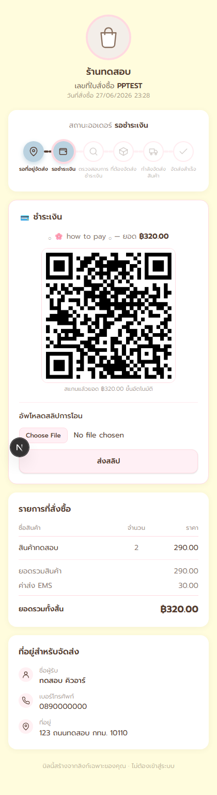
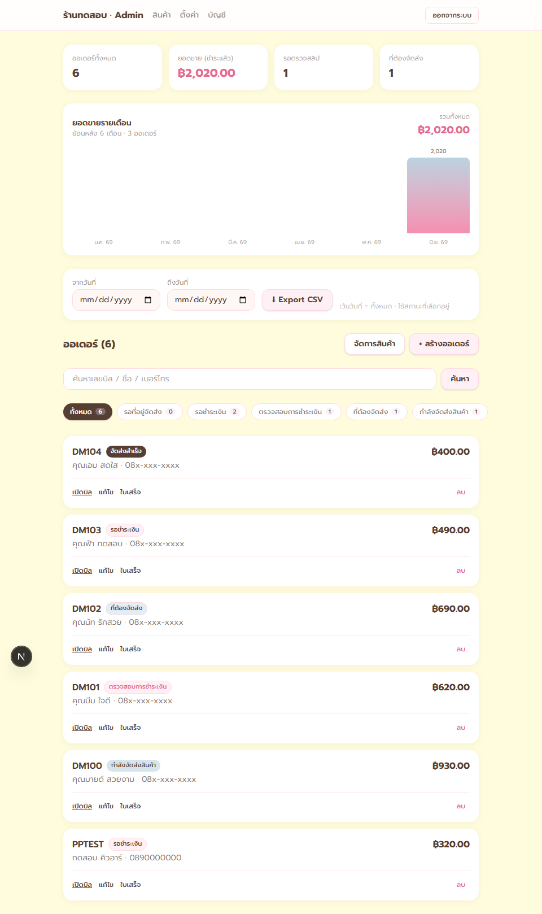

# 🛍️ Social Commerce OMS

ระบบจัดการออเดอร์ (Order Management) สำหรับร้านค้าออนไลน์ที่ขายผ่านแชต (LINE / Facebook / IG)
ร้านสร้างบิล → ส่ง **ลิงก์ลับ** ให้ลูกค้า → ลูกค้ากรอกที่อยู่ / ชำระเงิน / อัปสลิป / ติดตามพัสดุ **ได้เองโดยไม่ต้องล็อกอิน**

> ออกแบบมาเพื่อขายแบบ **1 ลูกค้า = 1 ระบบ** (deploy แยกต่อร้าน — ข้อมูลแยกขาด 100%)
> โครงสร้างภายในเป็น multi-tenant เต็มรูปแบบ (ผูกทุกอย่างกับ `storeId`) รองรับหลายร้านต่อ deploy ได้ในอนาคต

---

## ✨ ฟีเจอร์

**ฝั่งลูกค้า (เปิดจากลิงก์ในแชต — ไม่ต้องสมัคร/ล็อกอิน)**
- กรอกที่อยู่จัดส่งเอง · ดูรายการสินค้า/ยอดรวม/ส่วนลด
- **QR พร้อมเพย์อัตโนมัติ** ฝังยอดที่ต้องจ่าย (สแกนแล้วยอดขึ้นเอง) · อัปสลิปจากมือถือ (ย่อรูปอัตโนมัติ)
- ติดตามสถานะ 6 ขั้นแบบ timeline + ลิงก์เช็คเลขพัสดุ

**ฝั่งร้าน (Admin)**
- สร้าง/แก้บิล · มัดจำหรือจ่ายเต็ม · ส่วนลดต่อบิล · แคตตาล็อกสินค้า (พร้อมรูป)
- ตรวจสลิป (อนุมัติ/ปฏิเสธ) + **ตรวจสลิปอัตโนมัติ (EasySlip)** กันสลิปปลอม/ยอดไม่ตรง/สลิปซ้ำ · ใส่เลขพัสดุ · เช็คสถานะพัสดุอัตโนมัติ (ไปรษณีย์ไทย/Kerry/Flash/J&T)
- **แจ้งเตือน LINE** เข้าร้านเมื่อมีสลิปใหม่รอตรวจ
- Dashboard สถิติ + กราฟยอดขายรายเดือน · ค้นหา/กรอง/แบ่งหน้า (รองรับออเดอร์หลักพัน)
- **Export CSV** (เปิด Excel ภาษาไทยไม่เพี้ยน) · **ใบเสร็จพิมพ์ได้**
- จัดการผู้ใช้: เปลี่ยนรหัสเอง + เพิ่ม/ลบพนักงาน (สิทธิ์ owner / staff)

**ความปลอดภัย / ความเสถียร**
- Session แบบ signed cookie (HMAC) · รหัสผ่าน scrypt · timing-safe compare
- ความลับใน DB เข้ารหัส AES-256-GCM (LINE token ฯลฯ)
- Rate-limit login (Upstash Redis ถ้ามี / in-memory ถ้าไม่มี) · ตรวจไฟล์อัปโหลดด้วย magic bytes
- ลิงก์บิลเป็น token ลับ 32 hex · ข้อมูลแยกต่อร้านด้วย `storeId` (มี e2e ยืนยัน)
- **PDPA**: หน้านโยบายความเป็นส่วนตัว (`/privacy`) + checkbox ยินยอมก่อนเก็บข้อมูลลูกค้า (บันทึกเวลายินยอม)
- **Unit test** (Vitest) คุม logic เสี่ยง: เข้ารหัส · ตรวจสลิป · QR พร้อมเพย์ · rate-limit · magic byte

---

## 📸 ภาพหน้าจอ

| บิลลูกค้า (มือถือ) | หน้าจัดการร้าน (Admin) |
|---|---|
|  |  |

> ลูกค้าเปิดบิลจากลิงก์ในแชต เห็น QR พร้อมเพย์ที่ฝังยอดแล้ว · ร้านเห็นสถิติ ยอดขาย และจัดการออเดอร์ครบในที่เดียว
> ([ดูหน้าตั้งค่าร้าน](docs/screenshots/settings.png))

---

## 🧱 Tech stack

| ส่วน | เทคโนโลยี |
|------|-----------|
| Framework | Next.js 16 (App Router, Server Actions, Turbopack) + React 19 |
| Database | PostgreSQL (Neon) + Prisma 7 (driver adapter `pg`) |
| ไฟล์ (สลิป/รูป) | Vercel Blob (+ fallback เขียน disk ตอน dev) |
| UI | Tailwind CSS 4 |
| QR | `promptpay-qr` + `qrcode` |
| Test | Vitest (unit) + Playwright (e2e) |

---

## 🚀 เริ่มใช้งาน (local dev)

```bash
# 1) ติดตั้ง
npm install

# 2) ตั้งค่า .env (คัดลอกจากตัวอย่าง แล้วกรอก DATABASE_URL + SESSION_SECRET)
cp .env.example .env

# 3) สร้างตารางบน DB
npm run db:push

# 4) สร้างร้าน + บัญชี owner (อ่านค่าจาก .env: STORE_NAME / ADMIN_EMAIL / ADMIN_PASSWORD)
npm run bootstrap

# 5) รัน
npm run dev      # http://localhost:3000  ·  admin: /admin
```

> ⚠️ หลังแก้ `prisma/schema.prisma` แล้วรัน `db:push`/`prisma generate` ระหว่าง dev server เปิดอยู่ — ต้อง **restart dev server** (Prisma client โหลดครั้งเดียวตอนบูต)

---

## 📦 Scripts

| คำสั่ง | ทำอะไร |
|--------|--------|
| `npm run dev` | dev server |
| `npm run build` / `npm start` | production build / run |
| `npm run db:push` | sync schema → DB |
| `npm run bootstrap` | สร้างร้านเปล่า + owner (idempotent) |
| `npm test` | Vitest unit test (logic ล้วน ไม่ต้องมี DB) |
| `npm run e2e` | Playwright e2e (ต้องมี `DATABASE_URL`) |
| `npm run lint` | eslint |

---

## 📚 เอกสารเพิ่มเติม

- **[DEPLOY.md](./DEPLOY.md)** — ขั้นตอน deploy ต่อลูกค้า 1 ราย (Vercel + Neon + Blob), ~10–15 นาที/ราย
- **[USER_GUIDE.md](./USER_GUIDE.md)** — คู่มือใช้งานสำหรับเจ้าของร้าน (ภาษาคน ไม่ใช่ dev)
- **[ROADMAP.md](./ROADMAP.md)** — แผนพัฒนา/ฟีเจอร์ที่ทำแล้วและที่วางไว้

---

## 🏗️ สถาปัตยกรรมโดยย่อ

- **Flow 6 ขั้น (derived อัตโนมัติ):** `รอที่อยู่ → รอชำระ → ตรวจสลิป → ที่ต้องจัดส่ง → กำลังจัดส่ง → จัดส่งสำเร็จ`
  ระบบเลื่อนสเตปเองตามการกระทำจริง ไม่ต้องตั้งสถานะมือ
- **Multi-tenant:** ทุก query/mutation ฝั่ง admin scope ด้วย `getCurrentStoreId()` จาก session
- **บิล = ลิงก์ลับ:** ลูกค้าเข้าถึงด้วย token ใน URL เท่านั้น (ไม่ index, ไม่ต้องล็อกอิน)
- **Snapshot แบรนด์:** ชื่อ/โลโก้ร้านถูก snapshot ตอนสร้างบิล กันแบรนด์เปลี่ยนแล้วบิลเก่าเพี้ยน

โครงไฟล์หลัก: `src/app` (หน้า/route), `src/lib` (data + business logic), `src/components` (UI), `prisma/` (schema + scripts), `e2e/` (Playwright)
